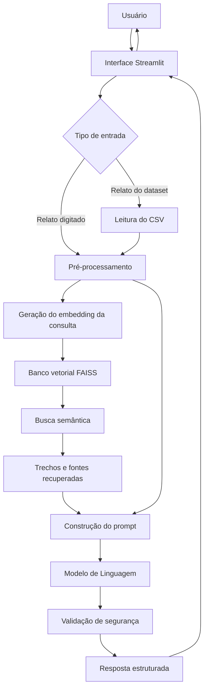
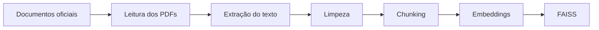
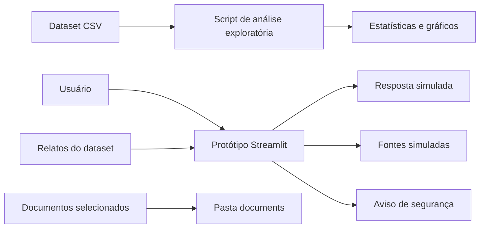

# Arquitetura da Solução – Zophia Lite RAG

## 1. Visão Geral

O Zophia Lite será desenvolvido utilizando uma arquitetura modular, separando a interface, o processamento dos dados, a recuperação de informações e a geração das respostas.

Essa separação facilita a manutenção, os testes e a evolução do sistema durante as próximas semanas do projeto.

Nesta primeira etapa, apenas o protótipo da interface e a organização dos componentes serão implementados. A geração de embeddings, o banco vetorial e a integração com o LLM serão desenvolvidos posteriormente.

---

## 2. Componentes da Arquitetura

### 2.1 Usuário

O usuário poderá:

- digitar um relato manualmente;
- selecionar um relato disponível no dataset;
- solicitar a análise do texto;
- visualizar a resposta estruturada;
- consultar as fontes previstas;
- visualizar o aviso de segurança.

---

### 2.2 Interface Web

A interface será desenvolvida com Streamlit.

Responsabilidades:

- receber o relato do usuário;
- permitir a seleção de relatos do dataset;
- enviar o texto para o módulo de processamento;
- apresentar a resposta estruturada;
- mostrar as fontes utilizadas;
- exibir permanentemente o aviso de segurança.

Na Semana 1, a resposta exibida será simulada com dados de exemplo.

---

### 2.3 Módulo de Pré-processamento

Esse módulo será responsável por preparar o texto antes de sua utilização no pipeline RAG.

Atividades previstas:

- remoção de espaços duplicados;
- normalização de quebras de linha;
- validação de entradas vazias;
- preservação do conteúdo original;
- padronização da codificação UTF-8.

O objetivo será realizar apenas ajustes simples, evitando remover informações importantes do relato.

---

### 2.4 Base de Relatos

O arquivo `mental_health_social_media_posts.csv` será utilizado para:

- selecionar exemplos de relatos;
- testar a interface;
- avaliar futuramente as respostas;
- apoiar a criação de exemplos few-shot;
- validar diferentes categorias de entrada.

Os principais campos utilizados serão:

- `id`;
- `post_content`;
- `tag`.

---

### 2.5 Base Documental

A base documental será composta por materiais científicos e institucionais relacionados à saúde mental.

Fontes selecionadas:

- WHO mhGAP;
- NICE Guideline sobre depressão;
- NICE Guideline sobre ansiedade;
- material institucional do CVV;
- referência oficial da RAPS;
- resumo autorizado ou referência permitida do DSM-5-TR.

Na Semana 1, os documentos serão apenas organizados e validados.

---

### 2.6 Módulo de Extração e Chunking

Nas próximas etapas, os documentos serão convertidos em texto e divididos em trechos menores.

Esse módulo será responsável por:

- ler documentos em PDF;
- extrair seu conteúdo textual;
- remover elementos inválidos;
- dividir o texto em chunks;
- preservar metadados como nome da fonte e página.

Esse componente ainda não será implementado na Semana 1.

---

### 2.7 Módulo de Embeddings

Os relatos e os trechos dos documentos serão convertidos em vetores numéricos.

Esses vetores representarão semanticamente o conteúdo dos textos e permitirão localizar informações semelhantes mesmo quando palavras diferentes forem utilizadas.

Esse módulo será implementado na Semana 2.

---

### 2.8 Banco Vetorial

O banco vetorial armazenará os embeddings dos trechos documentais.

A tecnologia inicialmente prevista é o FAISS.

Responsabilidades futuras:

- armazenar os vetores;
- executar busca por similaridade;
- recuperar os trechos mais relevantes;
- retornar os metadados das fontes.

---

### 2.9 Módulo de Recuperação RAG

Esse módulo receberá o relato processado e consultará o banco vetorial.

Fluxo previsto:

1. gerar o embedding do relato;
2. comparar com os embeddings da base;
3. selecionar os trechos mais relevantes;
4. enviar os trechos recuperados para o módulo de geração.

O número de trechos recuperados será configurável por meio do parâmetro `top-k`.

---

### 2.10 Prompt Engineering

O prompt reunirá:

- instruções de segurança;
- relato do usuário;
- trechos recuperados;
- estrutura obrigatória da resposta;
- restrição contra diagnósticos;
- exigência de exibir fontes.

O prompt orientará o modelo a responder apenas com base no contexto recuperado e nas diretrizes definidas pelo projeto.

---

### 2.11 Modelo de Linguagem

O Modelo de Linguagem será responsável por gerar a resposta final.

A resposta deverá conter:

1. acolhimento;
2. resumo do relato;
3. sinais observados;
4. informações educativas;
5. cuidados sugeridos;
6. quando procurar ajuda;
7. fontes;
8. aviso de segurança.

O modelo não deverá emitir diagnósticos clínicos.

---

### 2.12 Validação de Segurança

Antes de ser apresentada, a resposta deverá passar por verificações.

As principais regras serão:

- impedir afirmações diagnósticas;
- garantir a presença do aviso educacional;
- exibir as fontes recuperadas;
- orientar busca por apoio profissional quando necessário;
- fornecer orientação de emergência em situações de risco.

---

## 3. Fluxo Geral

---

## 4. Pipeline de Preparação da Base

---

## 5. Arquitetura da Semana 1

Durante a Semana 1, os seguintes componentes estarão disponíveis:

Os componentes de embeddings, banco vetorial e LLM aparecem na arquitetura geral, mas ainda não serão implementados nesta entrega.

---

## 6. Tecnologias Previstas

| Camada | Tecnologia |
|---|---|
| Linguagem | Python |
| Interface | Streamlit |
| Análise de dados | Pandas |
| Gráficos | Matplotlib |
| Leitura de PDF | PyMuPDF |
| Embeddings | Sentence Transformers |
| Banco vetorial | FAISS |
| Orquestração RAG | LangChain ou implementação própria |
| Modelo de Linguagem | API compatível com LLM |
| Versionamento | Git e GitHub |

---

## 7. Benefícios da Arquitetura

A arquitetura proposta apresenta os seguintes benefícios:

- separação clara de responsabilidades;
- facilidade de manutenção;
- possibilidade de substituir tecnologias;
- escalabilidade da base documental;
- rastreabilidade das fontes;
- maior controle sobre as respostas;
- facilidade de realizar testes;
- redução de respostas sem fundamentação;
- evolução gradual entre as semanas do projeto.

---

## 8. Considerações de Segurança

Como o sistema trata relatos relacionados à saúde mental, a arquitetura inclui restrições específicas.

O Zophia Lite:

- não realizará diagnóstico;
- não prescreverá medicamentos;
- não substituirá profissionais;
- utilizará documentos reconhecidos;
- apresentará fontes;
- exibirá aviso de segurança;
- indicará busca por ajuda profissional;
- deverá tratar relatos de risco com prioridade.

---

## 9. Conclusão

A arquitetura do Zophia Lite foi planejada para integrar interface, dataset, base documental, busca semântica e Modelo de Linguagem de forma modular.

Na primeira semana, o foco está na validação dos dados, organização documental, definição da resposta, planejamento técnico e construção do protótipo.

Nas etapas seguintes, essa estrutura permitirá implementar o RAG sem modificar significativamente a organização inicial do projeto.